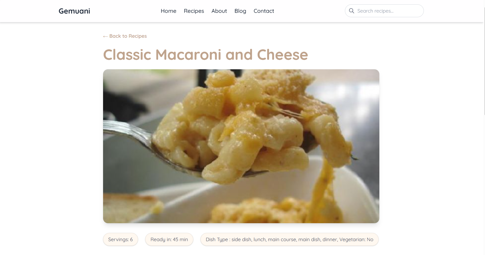
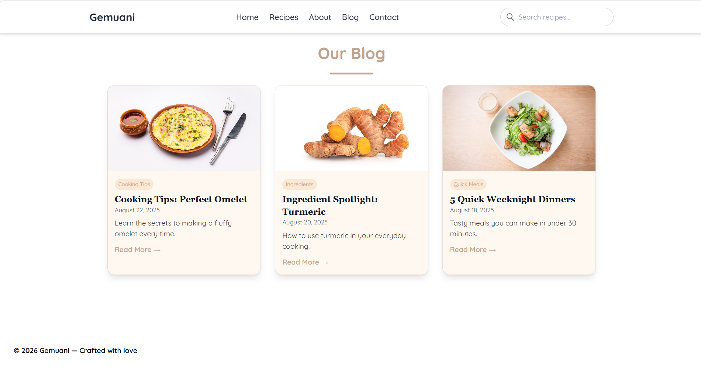
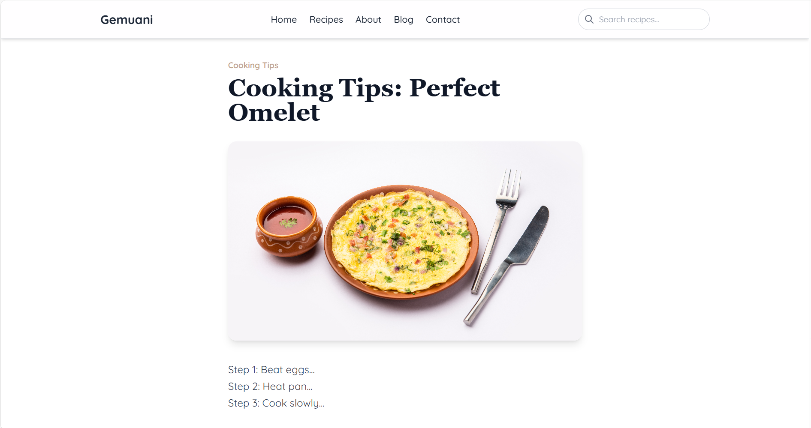
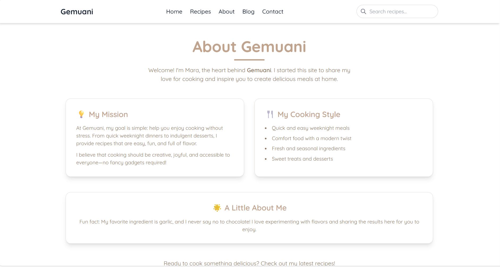
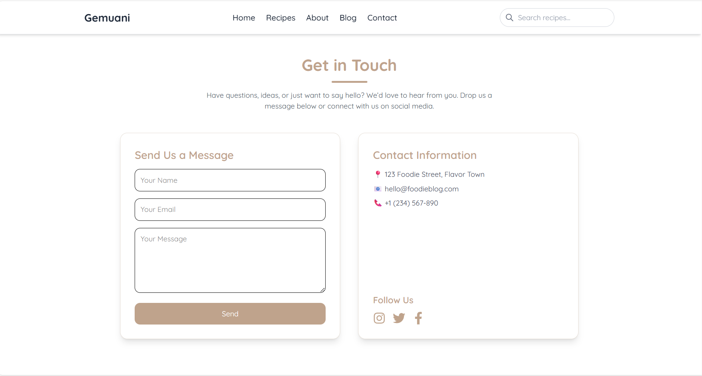

# Gemuani — Recipe Discovery App

Gemuani is a modern, responsive recipe discovery web application built with React.  
It allows users to explore random recipes, search for dishes, read blog content, and view detailed recipe instructions using data from the Spoonacular API.

This project was built as part of my frontend learning journey.

---

##  Features

- Discover random recipes
- Search recipes by keyword
- View detailed recipe pages
- Blog section with individual posts
- About and Contact pages
- Responsive design for desktop and mobile
- Loading states for better UX

---

##  Tech Stack

- **React**
- **React Router**
- **Vite**
- **Tailwind CSS**
- **Axios & Fetch API**
- **Spoonacular API**

---

##  Screenshots

### Home Page


### Recipes & Details


### Blog



### About & Contact



---

##  Live Demo

## Live Site

Check out the app live on Netlify: [https://gemuani.netlify.app](https://gemuani.netlify.app)


---

## ⚙️ Installation & Setup

1. Clone the repository:
```bash
git clone https://github.com/tamar-natchkebia/recipe.git
